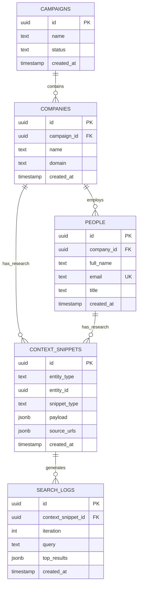

# Alpha Platform - Entity Relationship Diagram

## Entity Descriptions

### Campaigns
- **Purpose**: Top-level container for research initiatives
- **Key Fields**: name, status (draft/active/completed)
- **Relationships**: One-to-many with Companies

### Companies
- **Purpose**: Target organizations for research
- **Key Fields**: name, domain (extracted from emails)
- **Relationships**: 
  - Belongs to one Campaign
  - Has many People
  - Has many Context Snippets (research results)

### People
- **Purpose**: Individual contacts within companies
- **Key Fields**: full_name, email (unique), title
- **Relationships**: 
  - Belongs to one Company
  - Can have Context Snippets (personal research)
  - Triggers research via enrichment process

### Context Snippets
- **Purpose**: Stores structured research results
- **Key Fields**: 
  - entity_type: 'company' or 'person'
  - entity_id: References Company or Person
  - payload: JSON with research fields (company_value_prop, product_names, etc.)
  - source_urls: Array of URLs used in research
- **Relationships**: 
  - Polymorphic relationship with Companies/People
  - One-to-many with Search Logs

### Search Logs
- **Purpose**: Audit trail of search iterations
- **Key Fields**: iteration, query, top_results (URLs + snippets)
- **Relationships**: Belongs to one Context Snippet

## Data Flow

1. **Seed**: Campaign → Company → People
2. **Trigger**: POST `/enrich/{person_id}` starts research job
3. **Research**: Agent performs 1-3 search iterations
4. **Storage**: Results saved as Context Snippets with Search Logs
5. **Display**: UI shows research results from database

## Required Research Fields

The research agent attempts to find these fields for each company:
- `company_value_prop`: Business mission/value proposition
- `product_names`: Array of product/service names  
- `pricing_model`: How the company charges customers
- `key_competitors`: Array of main competitors
- `company_domain`: Company website domain